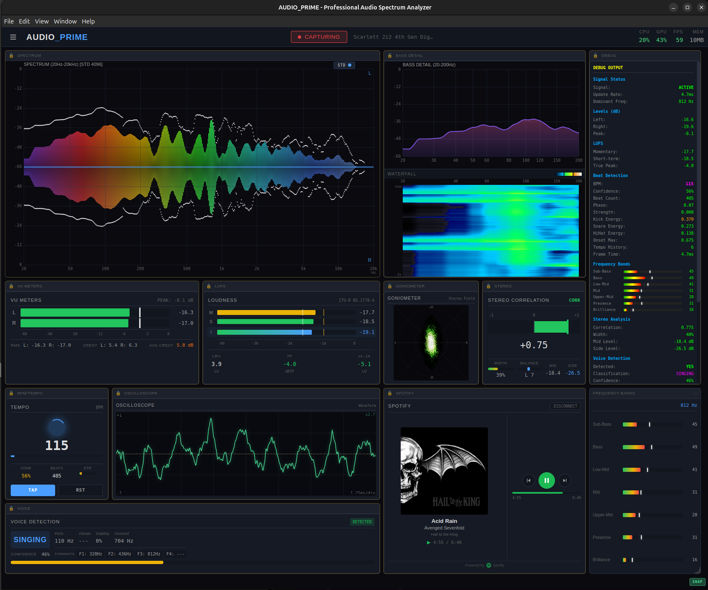

# AUDIO_PRIME

> Professional Real-Time Audio Spectrum Analyzer & Visualizer

A modern, high-performance audio analysis application built with Electron + Svelte 5, featuring studio-grade metering, advanced visualizations, and Spotify integration.


---

<p align="center">
  
  <br>
  <em>Full application layout with spectrum analyzer, LUFS metering, BPM detection, voice analysis, and Spotify integration</em>
</p>

---

## Features

### Spectrum Analysis
- **512-Bar Spectrum Analyzer** - Logarithmic frequency display from 20Hz to 20kHz
- **Enhanced Bass Detail** - Dedicated panel with optimized 20-500Hz resolution
- **Waterfall Spectrogram** - Time-frequency visualization with 60 FPS scrolling
- **Frequency Band Analysis** - Sub, Low, Mid, High, Presence, Air breakdown
- **Multi-Resolution FFT** - Adaptive resolution for optimal frequency/time tradeoff

### Professional Metering
- **LUFS Metering** - ITU-R BS.1770-4 compliant loudness measurement
  - Momentary (400ms)
  - Short-term (3s)
  - Integrated (gated)
  - True Peak detection (4x oversampling)
- **VU Meters** - Dual channel with peak hold indicators
- **BPM Detection** - Real-time tempo tracking with beat phase visualization

### Voice Analysis
- **Voice Activity Detection** - Real-time voice/no-voice classification
- **Voice Type Classification** - Singing vs. speech detection
- **Formant Tracking** - F1-F4 frequency analysis
- **Vibrato Detection** - 4.5-8.5 Hz modulation tracking
- **Pitch Detection** - Fundamental frequency estimation

### Stereo Analysis
- **Goniometer** - Lissajous stereo field display
- **Correlation Meter** - Phase relationship (-1 to +1)
- **M/S Metering** - Mid/Side level analysis
- **Oscilloscope** - Waveform display with auto-gain

### Spotify Integration
- **Now Playing** - Track, artist, album display with album art
- **Playback Controls** - Play/Pause, Previous, Next, Seek
- **OAuth Authentication** - Secure PKCE flow with encrypted token storage

---

## Installation

### Download (Recommended)

Download the latest release for your platform:
- **Linux**: `.AppImage` (universal), `.deb` (Ubuntu/Debian), `.rpm` (Fedora/RHEL)
- **macOS**: `.dmg` (Intel & Apple Silicon)

See [Releases](https://github.com/magicat777/AUDIO_PRIME/releases)

### Build from Source

#### Prerequisites
- **Node.js** 18+ and npm
- **Linux**: PipeWire or PulseAudio with `parec` command
- **macOS**: Core Audio (built-in)

#### Setup
```bash
# Clone repository
git clone https://github.com/magicat777/AUDIO_PRIME.git
cd AUDIO_PRIME

# Install dependencies
npm install

# Start development server
npm run dev

# Build for production
npm run build
```

---

## Spotify Setup

1. Create a Spotify Developer application at [developer.spotify.com](https://developer.spotify.com/dashboard)
2. Add `http://127.0.0.1:8888/callback` as a Redirect URI
3. Create a `.env` file in the project root:
   ```
   SPOTIFY_CLIENT_ID=your_client_id_here
   SPOTIFY_CLIENT_SECRET=your_client_secret_here
   ```
4. Restart the application
5. Click "Connect to Spotify" in the Spotify panel

**Note:** Spotify Premium is required for playback controls.

---

## Usage

### Keyboard Shortcuts

| Key | Action |
|-----|--------|
| `Space` | Toggle mute |
| `M` | Toggle mute |
| `F` | Toggle fullscreen |
| `D` | Toggle debug panel |
| `T` | Reset tempo detection |
| `B` | Toggle bass waterfall |
| `1-6` | Window size presets |

### Panel Controls
Use the sidebar toggles to show/hide panels:
- Spectrum Analyzer
- VU Meters
- Bass Detail & Waterfall
- LUFS Metering
- BPM/Tempo
- Voice Detection
- Stereo Analysis
- Debug Panel
- Spotify

---

## Architecture

```
┌─────────────────────────────────────────────────────────────────┐
│                         AUDIO_PRIME                             │
├─────────────────────────────────────────────────────────────────┤
│  ┌─────────────────────────────────────────────────────────┐   │
│  │                    SPECTRUM ANALYZER                     │   │
│  │              512 bars • 20Hz-20kHz • Logarithmic        │   │
│  └─────────────────────────────────────────────────────────┘   │
├─────────────────────────────────────────────────────────────────┤
│  ┌──────────┐ ┌──────────┐ ┌──────────┐ ┌──────────┐ ┌───────┐ │
│  │   VU L   │ │   VU R   │ │   LUFS   │ │   BPM    │ │ VOICE │ │
│  └──────────┘ └──────────┘ └──────────┘ └──────────┘ └───────┘ │
├─────────────────────────────────────────────────────────────────┤
│  ┌─────────────────────┐ ┌─────────────────────────────────┐   │
│  │    BASS DETAIL      │ │          WATERFALL              │   │
│  │    20-500Hz         │ │       Time-Frequency            │   │
│  └─────────────────────┘ └─────────────────────────────────┘   │
├─────────────────────────────────────────────────────────────────┤
│  ┌─────────────────────────────────────────────────────────┐   │
│  │  SPOTIFY: Track Name • Artist • Album       ◀ ▶ ▶▶     │   │
│  └─────────────────────────────────────────────────────────┘   │
└─────────────────────────────────────────────────────────────────┘
```

---

## Technical Details

### Audio Pipeline
1. **Capture**: `parec` subprocess captures system audio via PipeWire/PulseAudio
2. **Transport**: Raw PCM float32 data streamed to Electron main process
3. **Processing**: FFT analysis in AudioEngine with multi-resolution support
4. **Rendering**: 60 FPS canvas rendering in Svelte 5 components

### Performance
- **Frame Rate**: Stable 60 FPS
- **Audio Latency**: ~10ms end-to-end
- **FFT Processing**: ~1.5ms per frame
- **Memory Usage**: ~150MB typical (with leak detection)

### Tech Stack
| Component | Technology |
|-----------|------------|
| Framework | Electron 35 |
| UI | Svelte 5 |
| Build | Vite 6 |
| Language | TypeScript 5.7 (strict mode) |
| Rendering | Canvas 2D |
| Testing | Vitest |
| Linting | ESLint + Security plugins |

---

## Project Structure

```
AUDIO_PRIME/
├── electron/              # Main process
│   ├── main.ts            # Electron entry, IPC handlers, auto-updater
│   └── preload.ts         # Context bridge
├── src/
│   ├── components/        # Svelte 5 components
│   │   ├── layout/        # AppShell, ErrorBoundary
│   │   ├── panels/        # Spectrum, LUFS, BPM, Voice, etc.
│   │   └── spotify/       # Spotify integration
│   ├── core/              # AudioEngine, PerformanceMonitor
│   ├── analysis/          # LUFSMeter, BeatDetector
│   ├── stores/            # Svelte stores
│   └── types/             # TypeScript definitions
├── tests/                 # Vitest test suites
├── docs/                  # Documentation
│   ├── USER_GUIDE.md      # Comprehensive user documentation
│   ├── INSTALLATION.md    # Installation instructions
│   ├── TROUBLESHOOTING.md # Common issues & solutions
│   └── DELIVERY_PLAN.md   # Commercial release roadmap
├── build/                 # Build resources
│   └── entitlements.mac.plist
├── .github/workflows/     # CI/CD
│   └── security.yml       # Automated security scanning
├── CHANGELOG.md           # Version history
├── LICENSE                # MIT License
└── THIRD_PARTY_LICENSES.md
```

---

## Release Status

### Current Release: v1.1.0 (Linux)

| Phase | Status | Description |
|-------|--------|-------------|
| Phase 1 | ✅ Complete | Dependency & Framework Security |
| Phase 2 | ✅ Complete | Code Quality & Static Analysis |
| Phase 3 | ✅ Complete | API & Authentication Security |
| Phase 4 | ✅ Complete | Performance & Stability |
| Phase 5 | ✅ Complete | Testing & Documentation |
| Phase 6 | ✅ Complete | Distribution & Signing |
| Phase 7 | ✅ Complete | Pre-Release Testing (Linux) |
| Phase 8 | ✅ Complete | Delivery (Linux) |

### Platform Support
| Platform | Status | Version |
|----------|--------|---------|
| Linux | ✅ Released | v1.1.0 |
| macOS | 🚧 In Development | v1.2.0 |
| Windows | 📋 Planned | v1.3.0 |

### Build Formats
| Platform | Format | Status |
|----------|--------|--------|
| Linux | AppImage | ✅ Available |
| Linux | .deb | ✅ Available |
| Linux | .rpm | ✅ Available |
| macOS | .dmg (x64 + arm64) | 🚧 Coming v1.2.0 |
| Windows | NSIS installer | 📋 Coming v1.3.0 |

### Security Hardening
- ✅ Electron 35 with hardened security flags
- ✅ Content Security Policy (CSP)
- ✅ Context isolation & disabled node integration
- ✅ Encrypted token storage (safeStorage)
- ✅ Environment-based credential management
- ✅ ESLint security plugins
- ✅ Automated vulnerability scanning (CI/CD)

---

## Development

### Commands
```bash
npm run dev          # Start dev server with hot reload
npm run build        # Build for production (all platforms)
npm run test         # Run test suite
npm run lint         # Run ESLint
npm run type-check   # TypeScript validation
```

### Contributing
See [CONTRIBUTING.md](CONTRIBUTING.md) for guidelines.

---

## License

MIT License - See [LICENSE](LICENSE) file for details.

---

## Acknowledgments

- [Electron](https://www.electronjs.org/)
- [Svelte](https://svelte.dev/)
- [Vite](https://vitejs.dev/)
- [Spotify Web API](https://developer.spotify.com/documentation/web-api)
- ITU-R BS.1770-4 (LUFS Standard)
- EBU R128 (Broadcast Loudness)
