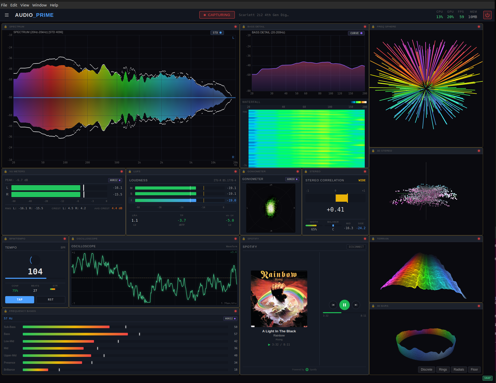

# AUDIO_PRIME

> *Breaking audio into its prime components*

A professional real-time audio spectrum analyzer and visualizer for Linux, built with Electron + Svelte 5. Features studio-grade metering, Hi-Res audio support up to 192kHz, 3D visualizations, MPRIS2 media player integration, and Spotify connectivity.




---

## Platform Support

**AUDIO_PRIME is a Linux-only application.**

| Platform | Status | Reason |
|----------|--------|--------|
| Linux | ✅ Supported | Native PulseAudio/PipeWire access via `parec` |
| macOS | ❌ Not Supported | Chromium limits system audio to mono only |
| Windows | ❌ Not Supported | No viable system audio capture path in Electron |

### Why Linux Only?

Professional audio analysis requires **stereo capture** for features like the goniometer, stereo correlation, and M/S metering. After extensive development effort, we found:

- **Linux**: Direct access to PulseAudio/PipeWire via `parec` subprocess provides full stereo audio capture outside of Chromium's sandbox.

- **macOS**: Apple's ScreenCaptureKit API supports stereo, but Chromium's `getDisplayMedia()` implementation only returns mono audio. Native Swift subprocesses can't inherit TCC (screen recording) permissions. A proper fix would require a native Node.js addon—significant complexity for uncertain results.

- **Windows**: Similar limitations exist with WASAPI loopback capture in Electron's sandboxed environment.

For cross-platform pro audio applications, native development (Swift/C++) is the appropriate choice. Electron excels for many use cases, but system audio capture for professional analysis isn't one of them.

---

## Features

### Spectrum Analysis
- **512-Bar Spectrum Analyzer** - Logarithmic frequency display from 20Hz to 20kHz
- **70dB Dynamic Range** - Extended range (-80dB to -10dB) for detailed low-level analysis
- **Enhanced Bass Detail** - Dedicated panel with optimized 20-200Hz resolution
- **Waterfall Spectrogram** - Time-frequency visualization with 60 FPS scrolling
- **Frequency Band Analysis** - Sub-Bass, Bass, Low-Mid, Mid, Upper-Mid, Presence, Brilliance
- **Multi-Resolution FFT** - Adaptive resolution for optimal frequency/time tradeoff
- **Perceptual Weighting** - Psychoacoustic compensation for balanced visual display

### Professional Metering
- **LUFS Metering** - ITU-R BS.1770-4 compliant loudness measurement
  - Momentary (400ms)
  - Short-term (3s)
  - Integrated (gated)
  - True Peak detection (4x oversampling)
- **VU Meters** - Dual channel with peak hold indicators
- **BPM Detection** - Real-time tempo tracking with beat phase visualization

### Voice Analysis
- **Voice Activity Detection** - Real-time voice/no-voice classification
- **Voice Type Classification** - Singing vs. speech detection
- **Formant Tracking** - F1-F4 frequency analysis
- **Vibrato Detection** - 4.5-8.5 Hz modulation tracking
- **Pitch Detection** - Fundamental frequency estimation

### Stereo Analysis
- **Goniometer** - Lissajous stereo field display
- **Correlation Meter** - Phase relationship (-1 to +1)
- **M/S Metering** - Mid/Side level analysis
- **Oscilloscope** - Waveform display with auto-gain

### 3D Visualizations (v1.2.0)
- **Cylindrical Bars** - 3D spectrum arranged around a cylinder with auto-rotation, optional rings/radials/floor
- **3D Waterfall** - Spectrum history rendered as a scrolling 3D surface mesh
- **Frequency Sphere** - Pulsating sphere with beat-reactive scaling and frequency-mapped spikes
- **3D Stereo Space** - Point cloud visualization of stereo field with color-coded L/R channels
- **Tunnel Effect** - Forward-scrolling concentric rings (lines/filled/both render modes)
- **Terrain Landscape** - Fly-over spectrum terrain with fog depth and multi-pass smoothing

### Hi-Res Audio Support (v1.3.0)
- **Dynamic Sample Rate** - Auto-detects and captures at native device rate (44.1kHz to 192kHz)
- **Hi-Res Audio Badge** - Official logo displayed when playing content above 44.1kHz
- **Rate-Aware Analysis** - FFT, LUFS K-weighting filters, and beat detection auto-reconfigure for the active sample rate
- **Zero-Copy IPC** - ArrayBuffer transfer for high-throughput audio data at 192kHz

### Media Player Integration (v1.3.0)
- **MPRIS2 Panel** - Connects to Strawberry, mpv, VLC, Firefox, or any MPRIS2 player via D-Bus
- **Album Art** - Loads cover art from player cache with automatic display
- **Playback Controls** - Play/Pause, Previous, Next, Seek, Shuffle, Loop
- **Bitrate Display** - Shows live bitrate (e.g., 4.3 Mbps for 192kHz FLAC)

### Spotify Integration
- **Now Playing** - Track, artist, album display with album art
- **Playback Controls** - Play/Pause, Previous, Next, Seek
- **OAuth Authentication** - Secure PKCE flow with encrypted token storage

---

## Installation

> **Note:** AUDIO_PRIME currently supports **Linux only** due to limitations with system audio capture in Electron on macOS and Windows.

### Download (Recommended)

Download the latest release from [Releases](https://github.com/magicat777/AUDIO_PRIME/releases):
- **AppImage** - Universal Linux (recommended, no install required)
- **.deb** - Ubuntu, Debian, Pop!_OS, Linux Mint

### Linux Installation

#### AppImage (Easiest)
```bash
chmod +x AUDIO_PRIME-*.AppImage
./AUDIO_PRIME-*.AppImage
```

#### Debian/Ubuntu (.deb)
```bash
# Recommended: Use dpkg directly to avoid apt sandbox warnings
sudo dpkg -i AUDIO_PRIME-*-linux-amd64.deb

# Install any missing dependencies
sudo apt-get install -f
```

#### Fedora/RHEL (.rpm)
```bash
sudo rpm -i AUDIO_PRIME-*-linux-x86_64.rpm
```

### System Requirements

- **OS**: Linux (Ubuntu 20.04+, Fedora 35+, or equivalent)
- **Audio**: PipeWire or PulseAudio with `parec` command
- **Display**: 1920x1080 or higher recommended

### Build from Source

```bash
# Prerequisites: Node.js 22 LTS and npm

# Clone repository
git clone https://github.com/magicat777/AUDIO_PRIME.git
cd AUDIO_PRIME

# Install dependencies
npm install

# Start development server
npm run dev

# Build for production
npm run build
```

---

## Spotify Setup

Spotify integration requires you to create your own Spotify Developer application (free):

1. Create an app at [developer.spotify.com/dashboard](https://developer.spotify.com/dashboard)
2. Add `http://127.0.0.1:8888/callback` as a Redirect URI
3. Create `~/.config/audio-prime/.env`:
   ```
   SPOTIFY_CLIENT_ID=your_client_id_here
   SPOTIFY_CLIENT_SECRET=your_client_secret_here
   ```
4. Restart AUDIO_PRIME and click "Connect to Spotify"

See the [User Guide](docs/USER_GUIDE.md#spotify-integration) for detailed instructions.

**Note:** Spotify Premium is required for playback controls. Free accounts can view now-playing info.

---

## Usage

### Keyboard Shortcuts

#### Controls
| Key | Action |
|-----|--------|
| `Space` | Start/Stop capture |
| `M` | Toggle menu |
| `F` | Toggle fullscreen |
| `ESC` | Exit fullscreen / Close menu |
| `Q` | Quit application |

#### 2D Panels
| Key | Action |
|-----|--------|
| `S` | Spectrum |
| `U` | VU Meters |
| `B` | Bass Detail |
| `W` | Waterfall |
| `L` | LUFS |
| `T` | Tempo/BPM |
| `V` | Voice Detection |
| `C` | Stereo Correlation |
| `G` | Goniometer |
| `O` | Oscilloscope |
| `N` | Frequency Bands |
| `D` | Debug |
| `Alt+Shift+S` | Spotify |

#### 3D Panels
| Key | Action |
|-----|--------|
| `Shift+B` | 3D Bars (Cylinder) |
| `Shift+W` | 3D Waterfall |
| `Shift+F` | Frequency Sphere |
| `Shift+S` | 3D Stereo Space |
| `Shift+T` | Tunnel Effect |
| `Shift+L` | Terrain Landscape |

#### Layout Controls
| Key | Action |
|-----|--------|
| `Alt+L` | Lock/Unlock all panels |
| `Alt+T` | Toggle grid |
| `Alt+S` | Toggle snap |
| `Alt+A` | Auto-arrange |
| `Alt+R` | Reset layout |

### Panel Controls
Use the sidebar toggles to show/hide panels:
- Spectrum Analyzer
- VU Meters
- Bass Detail & Waterfall
- LUFS Metering
- BPM/Tempo
- Voice Detection
- Stereo Analysis (Goniometer, Correlation, Oscilloscope)
- Debug Panel
- Spotify
- 3D Visualizations (Cylindrical Bars, Frequency Sphere, 3D Stereo, 3D Waterfall, Tunnel, Terrain)

### Layout System
- **Drag & Drop** - Move panels anywhere on the canvas
- **Resize** - Drag panel edges to resize
- **Lock/Unlock** - Lock panels to prevent accidental moves
- **Auto-Arrange** - Press `Shift+A` to auto-arrange all panels
- **Layout Presets** - Save up to 5 custom layouts
- **Grid Snap** - Optional grid snapping for alignment
- **Persistent Storage** - Layouts saved automatically to `~/.config/audio-prime/`

---

## Technical Details

### Audio Pipeline
1. **Capture**: `parec` subprocess captures system audio via PipeWire/PulseAudio
2. **Transport**: Raw PCM float32 data streamed to Electron main process
3. **Processing**: FFT analysis in AudioEngine with multi-resolution support
4. **Rendering**: 60 FPS canvas rendering in Svelte 5 components

### Performance
- **Frame Rate**: Stable 60 FPS
- **Audio Latency**: ~10ms end-to-end
- **FFT Processing**: ~1.5ms per frame
- **Memory Usage**: ~150MB typical

### Tech Stack
| Component | Technology |
|-----------|------------|
| Framework | Electron 35 |
| UI | Svelte 5 |
| Build | Vite 6 |
| Language | TypeScript 5.7 (strict mode) |
| 2D Rendering | Canvas 2D + WebGL2 |
| 3D Rendering | WebGL2 (custom shaders) |
| Audio | PulseAudio/PipeWire (parec) |
| Testing | Vitest |
| Linting | ESLint + Security plugins |

---

## Project Structure

```
AUDIO_PRIME/
├── electron/              # Main process
│   ├── main.ts            # Electron entry, IPC handlers, auto-updater
│   ├── preload.ts         # Context bridge
│   └── audio/             # Audio capture module
│       ├── AudioCapture.ts
│       ├── LinuxCapture.ts
│       ├── types.ts
│       └── index.ts
├── src/
│   ├── components/        # Svelte 5 components
│   │   ├── layout/        # AppShell, ErrorBoundary
│   │   ├── panels/        # Spectrum, LUFS, BPM, Voice, etc.
│   │   └── spotify/       # Spotify integration
│   ├── core/              # AudioEngine, PerformanceMonitor
│   ├── analysis/          # LUFSMeter, BeatDetector
│   ├── stores/            # Svelte stores
│   └── types/             # TypeScript definitions
├── tests/                 # Vitest test suites
├── docs/                  # Documentation
│   ├── USER_GUIDE.md      # Comprehensive user documentation
│   ├── INSTALLATION.md    # Installation instructions
│   └── TROUBLESHOOTING.md # Common issues & solutions
├── .github/workflows/     # CI/CD
│   └── security.yml       # Automated security scanning
├── CHANGELOG.md           # Version history
├── LICENSE                # MIT License
└── THIRD_PARTY_LICENSES.md
```

---

## Security

- ✅ Electron 35 with hardened security flags
- ✅ Content Security Policy (CSP)
- ✅ Context isolation & disabled node integration
- ✅ Encrypted token storage (safeStorage)
- ✅ Environment-based credential management
- ✅ ESLint security plugins
- ✅ Automated vulnerability scanning (CI/CD)

### Build Targets
| Platform | Format | Status |
|----------|--------|--------|
| Linux | AppImage | ✅ Supported |
| Linux | .deb | ✅ Supported |
| Linux | .rpm | ✅ Supported |
| macOS | .dmg | ❌ Not supported (audio capture limitations) |
| Windows | NSIS | ❌ Not supported (audio capture limitations) |

---

## Development

### Commands
```bash
npm run dev          # Start dev server with hot reload
npm run build        # Build for production
npm run test         # Run test suite
npm run lint         # Run ESLint
npm run type-check   # TypeScript validation
```

### Contributing
See [CONTRIBUTING.md](CONTRIBUTING.md) for guidelines.

---

## License

MIT License - See [LICENSE](LICENSE) file for details.

---

## Acknowledgments

- [Electron](https://www.electronjs.org/)
- [Svelte](https://svelte.dev/)
- [Vite](https://vitejs.dev/)
- [PulseAudio](https://www.freedesktop.org/wiki/Software/PulseAudio/)
- [PipeWire](https://pipewire.org/)
- [Spotify Web API](https://developer.spotify.com/documentation/web-api)
- ITU-R BS.1770-4 (LUFS Standard)
- EBU R128 (Broadcast Loudness)
